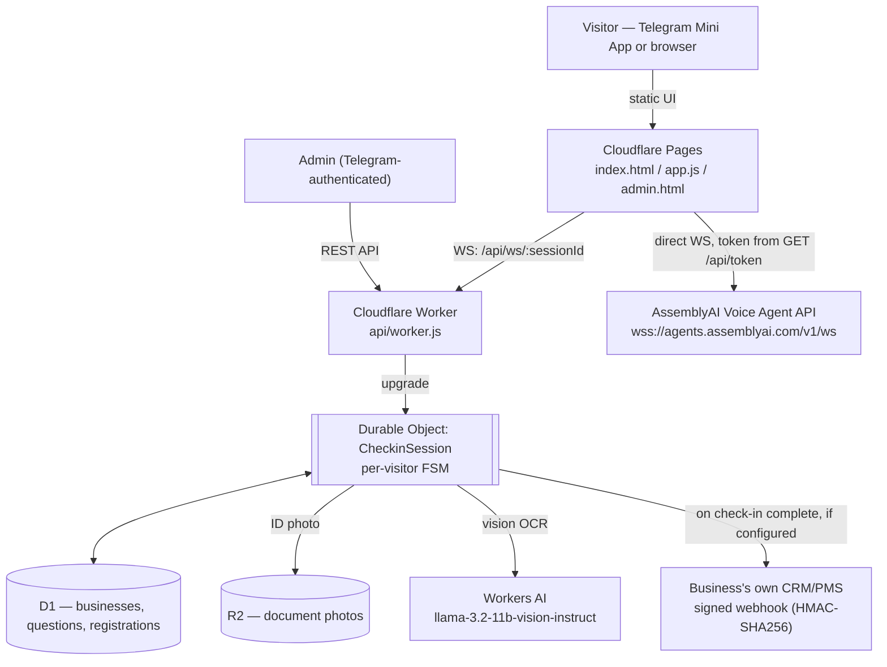

---

# Virtualobby — Universal Virtual Reception Agent

[](https://lablab.ai/ai-hackathons/assemblyai-voice-agent-hackathon)
[](https://workers.cloudflare.com)
[](https://www.assemblyai.com/docs/voice-agents/voice-agent-api)
[](https://intakeai-col.pages.dev)
[](./LICENSE)

Submission for lablab.ai's **AssemblyAI Voice Agent Hackathon**
(1–30 Sep 2026).

**For judges:** [Business directory](https://intakeai-col.pages.dev/admin-panel-view.html) —
a public, read-only view of how each business is configured (welcome
message, questions), no login needed. It's not the real admin panel: that one
requires a Telegram session and is intentionally locked down, since it can
create/edit/delete real businesses and see visitors' personal data.

> **Scan documents, ask questions, register visitors — all by voice.**

Virtualobby is a universal reception agent powered by AssemblyAI's Voice Agent API. It combines voice interaction with document scanning (OCR) to automate visitor registration for any business.

## 🎯 What it does

1. **Greets** the visitor by voice
2. **Scans** their ID document via camera (OCR)
3. **Asks** business-specific questionnaire questions
4. **Confirms** all information by voice
5. **Registers** the visitor automatically

## 🏢 Works for any business

| Template | Use case |
|----------|----------|
| 🏥 `clinic` | Medical clinic check-in, triaje |
| ⚖️ `lawyer` | Law firm client intake |
| 🏨 `hotel` | Hotel guest check-in |
| 🏢 `office` | Office visitor registration |
| 🎪 `event` | Event attendee registration |

## 🚪 Two ways to deploy

Same engine, two front doors — the name is literal:

- **On-site kiosk** — a tablet or phone at your actual front desk, walk-up check-in.
- **Virtual lobby** — no location at all. Send the same link to someone
  remotely, days ahead of an appointment: a law firm's client explains their
  case and uploads documents by voice before ever walking into the office.

## 📱 WebApp (Mobile-First)

The webapp works as:

1. **Telegram Mini App** — Open [@Virtu_intake_bot](https://t.me/Virtu_intake_bot) in Telegram
2. **Standalone Web Page** — [intakeai-col.pages.dev](https://intakeai-col.pages.dev), or any URL it's deployed to

### Features

- 📷 Camera access for document scanning
- 🎤 Voice interaction with AssemblyAI
- 📱 Mobile-first responsive design
- 🔍 Server-side OCR via Workers AI vision (`@cf/meta/llama-3.2-11b-vision-instruct`) — not browser-side
- 🎯 Works on phone, tablet, and desktop

## How it works



The browser talks to AssemblyAI **directly** over its own WebSocket — the
Worker only mints a short-lived token (`GET /api/token`) and never sees or
relays audio. The Durable Object never talks to AssemblyAI either; it only
holds the FSM state, reads/writes D1, stores the ID photo in R2, and runs
OCR through Workers AI. Full write-up: [`PLAN.md`](PLAN.md).

## 🚀 Quick Start (real deployment: Cloudflare)

This is what's actually deployed and what `telegram/webapp/app.js` and
`admin.html` talk to — not the Python server described further down, which is
an earlier/reference build. See `PLAN.md` for the full architecture writeup.

### 1. Clone & configure

```sh
git clone https://github.com/Alejdro83/intakeai.git
cd intakeai
wrangler login
```

### 2. Create the D1 database and R2 bucket (first deploy only)

```sh
wrangler d1 create virtualobby-db      # copy the returned database_id into wrangler.toml
wrangler r2 bucket create virtualobby-docs
wrangler d1 execute virtualobby-db --remote --file ./schema.sql
wrangler d1 execute virtualobby-db --remote --file ./seed.sql
```

### 3. Set secrets

```sh
wrangler secret put ASSEMBLYAI_API_KEY
wrangler secret put TELEGRAM_BOT_TOKEN   # only needed for the Telegram bot webhook
```

`ADMIN_TELEGRAM_IDS` (who can use `admin.html`'s write endpoints) is a plain
var in `wrangler.toml`, not a secret — edit it directly.

### 4. Deploy

```sh
wrangler deploy
```

The Worker serves the API (`api/worker.js` + the `CheckinSession` Durable
Object in `api/checkin-do.js`). `telegram/webapp/` (the two UIs) is a static
site — deploy it separately as a Cloudflare Pages project, or serve it from
any static host, pointed at your Worker's URL via `CONFIG.API_URL` in `app.js`.

### 5. Open it

- Visitor check-in: your Pages URL, or as a Telegram Mini App via
  `https://t.me/<your_bot>?start=business_<id>`
- Admin panel: `<your-pages-url>/admin.html` (Telegram-authenticated)
- Read-only business directory: `<your-pages-url>/admin-panel-view.html`
  (public, no login — see "For judges" above)

## 📁 Project Structure

```
intakeai/
├── agents/
│   └── intake-clinic.jsonc    # AssemblyAI agent definition — NOT used by the live
│                               # app (app.js configures the agent per-session via
│                               # session.update instead); kept as reference/legacy
├── api/
│   ├── worker.js               # Cloudflare Worker: REST API, AssemblyAI token proxy,
│   │                            # Telegram initData auth
│   └── checkin-do.js           # Durable Object: per-visitor FSM, D1 writes, R2 reads,
│                                # Workers AI OCR
├── schema.sql / seed.sql       # D1 schema + demo data
├── wrangler.toml                # Cloudflare Worker + D1 + R2 + DO + Workers AI config
├── telegram/webapp/             # The two UIs (static, no build step)
│   ├── index.html / app.js      # Visitor check-in (voice + camera)
│   └── admin.html                # Business/questions config + registrations
├── deployment/, api/server.py, lib.py, publish.py, import_agent.py
│                               # Earlier plain-Python build from the AssemblyAI
│                               # starter template — see AGENTS.md. Not what's
│                               # deployed; kept for local experimentation.
└── PLAN.md                     # Full architecture + decision log
```

## 📄 Files (real deployment)

| Path | Role |
|---|---|
| `api/worker.js` | Router: businesses/questions/registrations CRUD, AssemblyAI token minting, Telegram initData verification, Telegram bot webhook |
| `api/checkin-do.js` | `CheckinSession` Durable Object — one per visitor: FSM state, D1 reads/writes, R2 photo storage, Workers AI OCR, webhook delivery |
| `telegram/webapp/app.js` | Visitor UI logic — camera capture, downscaling, the WebSocket to the Durable Object, and the second WebSocket straight to AssemblyAI |
| `telegram/webapp/index.html` | Visitor check-in page markup |
| `telegram/webapp/admin.html` | Admin panel — business/question/voice/webhook config, QR/link generation, registrations list |
| `schema.sql` | D1 schema: `businesses`, `business_questions`, `guest_registrations` |
| `seed.sql` | Demo business + questions for a fresh deploy |
| `wrangler.toml` | Worker + D1 + R2 + Durable Object + Workers AI + observability config |
| `PLAN.md` | Full architecture write-up and decision log |

## 🔧 API Endpoints (Cloudflare Worker, `api/worker.js`)

| Endpoint | Method | Auth | Description |
|----------|--------|------|-------------|
| `/api/health` | GET | — | Health check |
| `/api/token` | GET | — | Mints a short-lived AssemblyAI Voice Agent token |
| `/api/ws/:sessionId` | GET | — | WebSocket upgrade to that visitor's Durable Object |
| `/api/ws/:sessionId` | PUT | session state | Upload the ID photo (only while that session is `scanning_doc`) |
| `/api/businesses` | GET | — | List businesses |
| `/api/businesses` | POST | admin | Create a business (+ its questions) |
| `/api/businesses/:id` | GET/PUT/DELETE | PUT/DELETE: admin | Get/update/delete a business |
| `/api/businesses/:id/questions` | GET/POST/DELETE | POST/DELETE: admin | Get/replace/clear a business's questions |
| `/api/businesses/:id/registrations` | GET | admin | List completed check-ins (PII) |
| `/api/businesses/:id/registrations/:regId` | DELETE | admin | Delete a single registration |
| `/api/telegram` | POST | — | Telegram bot webhook |

"admin" endpoints require an `X-Telegram-Init-Data` header carrying
`Telegram.WebApp.initData`, verified server-side against `ADMIN_TELEGRAM_IDS`.

## 🎤 How the Voice Agent Works

The live app does **not** use a published AssemblyAI agent (`agents/intake-clinic.jsonc`
is legacy/reference — see above). Instead, `app.js` connects the browser
directly to `wss://agents.assemblyai.com/v1/ws` with a token minted by
`GET /api/token`, then configures the whole conversation per-session via
`session.update`: the system prompt, greeting, and OCR data (if any) are built
client-side from what the Durable Object already sent over its own WebSocket,
and three function tools let the agent report back what the visitor said:
`submit_answer` (field + value — also used to correct an earlier answer),
`correct_ocr_field` for fixing a misread ID field, and `confirm_registration`,
the only thing that actually finalizes a check-in once the visitor confirms
the summary. A manual "✅ Yes, that's correct" button on the summary screen
sends the same confirmation directly, as a backup for when the agent doesn't
call the tool. The Durable Object never talks to AssemblyAI directly — it
only holds the FSM state, D1 reads/writes, and runs OCR via Workers AI when
a document photo comes in.

Voice only activates from an explicit "Tap to Start" gesture — browsers
require AudioContext/microphone activation to happen inside a real user
gesture's call stack, and starting it from an async WebSocket callback (the
original design) left it stuck "suspended" forever with no visible error.

## 📱 Telegram Mini App

To set up as a Telegram Mini App:

1. Create a bot with @BotFather
2. Set the WebApp URL to your deployed static site (Pages URL)
3. Users can open the Mini App from the bot menu, or via
   `https://t.me/<bot>?start=business_<id>` to preselect a business

## 📋 Adding a New Business Template

Use `admin.html` (needs a Telegram ID in `ADMIN_TELEGRAM_IDS`), or call the
API directly:

```sh
curl -X POST https://<your-worker>/api/businesses \
  -H "Content-Type: application/json" \
  -H "X-Telegram-Init-Data: <initData from Telegram.WebApp>" \
  -d '{
    "name": "My Business", "business_type": "office",
    "welcome_message": "Welcome!",
    "voice_id": "anna",
    "voice_persona": "warm and reassuring, speaks slowly",
    "requires_id_scan": true,
    "webhook_url": "https://your-crm.example.com/webhooks/checkin",
    "webhook_secret": "a-shared-secret-you-pick",
    "questions": ["First question?", "Second question?"]
  }'
```

`voice_id` must be one of AssemblyAI's real catalog IDs (see
[Voices](https://www.assemblyai.com/docs/voice-agents/voice-agent-api/voices)) —
it's what actually gets spoken. `voice_persona` is free-text tone/style
guidance fed into the agent's system prompt; it never selects the TTS voice
itself. Both `webhook_url` and `webhook_secret` are optional — see below.

## 🔌 Webhook (plug into your existing CRM/PMS)

When a check-in completes, if a business has `webhook_url` set, the Durable
Object POSTs the visitor's data there — no custom integration needed on
either side:

```json
{
  "event": "checkin.completed",
  "business_id": "my-business",
  "business_name": "My Business",
  "registration_id": "...",
  "created_at": "2026-09-14T00:00:00.000Z",
  "answers": { "full_name": "...", "...": "..." },
  "ocr_data": { "name": "...", "date_of_birth": "...", "...": "..." }
}
```

If `webhook_secret` is also set, the request carries an
`X-Virtualobby-Signature: sha256=<hmac>` header — an HMAC-SHA256 of the raw
JSON body using that secret — so the receiving system can verify it actually
came from Virtualobby. Delivery is fire-and-forget and never blocks or fails
the visitor's check-in; only `https://` URLs are accepted.

## 🏆 Hackathon: AssemblyAI Voice Agent Hackathon

- **Event:** [AssemblyAI Voice Agent Hackathon](https://lablab.ai/ai-hackathons/assemblyai-voice-agent-hackathon/)
- **Deadline:** September 30, 2026
- **Prize:** $10,000 ($5K cash + $5K AAI credits)

### What makes Virtualobby different

- **Multimodal** — voice + vision (document scanning)
- **Universal** — works for any business with configurable templates
- **Real-world value** — eliminates repetitive reception work
- **Mobile-first** — works on phone, tablet, and desktop
- **Telegram integration** — Mini App for zero-friction access
- **Plugs into what a business already runs** — an optional signed webhook
  delivers each check-in to any existing CRM/PMS, no custom integration work
  required on either side

## Honest scope notes

What this is *not*, yet — called out directly rather than left for someone
to discover:

- **Offline regression tests, not a production voice certification.** Run
  `node --test tests/*.test.mjs` with Node 24 or later; no dependencies need
  installing. The suite exercises the real client and Durable Object with
  synthetic devices/events, including integration tests against SQLite and
  the repository schema. See [tests/README.md](tests/README.md) for scope,
  protocol and rollout notes. Live ASR/LLM/TTS and deployed Cloudflare behavior
  still need an end-to-end check; these tests are not yet wired to CI.
- **No PII retention/deletion policy.** Visitor data — scanned ID photos in
  R2, answers and OCR fields (name, date of birth, ID number) in D1 —
  persists indefinitely once a check-in completes. `admin.html` can delete a
  registration one at a time; there's no automatic expiry, export, or
  right-to-erasure flow.
- **Single-tier admin auth.** Anyone whose Telegram ID is in
  `ADMIN_TELEGRAM_IDS` has full write access to every business — no roles,
  no per-business permissions, no audit log of who changed what.
- **Webhook delivery has no retry.** A failed or timed-out delivery to a
  business's `webhook_url` is logged and dropped, not queued or retried.
- **No per-tenant usage limits.** Every business shares the same
  AssemblyAI/Workers AI budget; nothing here caps or meters cost per
  business.
- **OCR accuracy depends on photo quality and lighting.** The conversational
  correction flow (`correct_ocr_field`) is the intended fallback for a
  misread field — there's no confidence threshold or automatic re-scan
  prompt.

## 📚 References

- [AssemblyAI Voice Agent API](https://www.assemblyai.com/docs/voice-agents/voice-agent-api)
- [Voice Agent Starter (Python)](https://github.com/AssemblyAI/voice-agent-starter-python)
- [AssemblyAI Voices](https://www.assemblyai.com/docs/voice-agents/voice-agent-api/voices)
- [Telegram Mini Apps](https://core.telegram.org/api/webapps)
